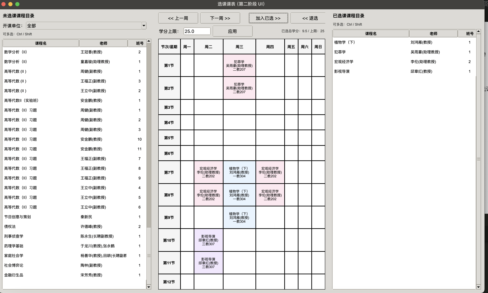
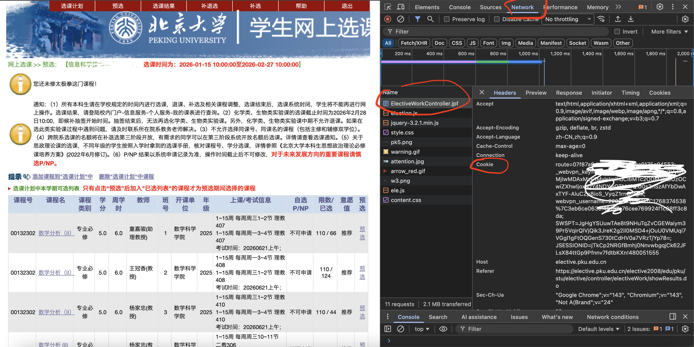

# 北大选课助手 (PKU Course Helper)

一个用于爬取北大选课系统课程信息、智能解析课表、可视化选课管理的工具集。



## ✨ 功能特性

- **课程数据爬取**: 自动从北大选课系统获取所有可选课程信息
- **智能课表解析**: 支持节次制与钟点制的自动识别与转换
- **可视化选课**: 图形界面展示课表、检测时间冲突、学分管理
- **多条件筛选**: 按开课单位、教师、学分等维度过滤课程
- **冲突检测**: 自动识别时间冲突,防止选课失败

## 快速开始

### 环境要求

- Python 3.8+
- 依赖包:
  ```bash
  pip install requests beautifulsoup4 openpyxl
  ```

- 建议直接用conda：
    ```bash
    conda create -n pku-crawler python=3.11 -y
    conda activate pku-crawler
    pip install requests beautifulsoup4 openpyxl
    ```


### 使用流程

#### 1. 爬取课程数据

```bash
python class_info_crawler.py
```

**重点**: 需要先登录北大选课系统,获取有效的 Cookie 并替换 `class_info_crawler.py` 中的 Cookie 字段。

具体而言，这一步需要先进入到”预选“的页面，然后打开开发者模式
1. 对于macbook用户,按住`command⌘ + option⌥ + I`
2. 对于linux电脑用户，按住`F12 或 Ctrl + Shift + I`
3. 对于windows电脑用户，同样也是`F12 或 Ctrl + Shift + I`



类似上图的页面，点击`Network`，然后找到`ElectiveWorkController.jpf`,点击一下它（注意不要双击，因为双击似乎是会跳出一个新的选课界面并且提示你“你的登录已过期”，然后cookie就失效了，就需要重新登录了）；然后找到`Request Header`里的`cookie`,记住这里的cookie，复制到[class_info_crawler.py](./class_info_crawler.py)里的第十八行，直接替换即可

##### 关于 `User-Agent` 与 `Referer`（建议问ai来设置，并非最关键的字样）

在 `class_info_crawler.py` 里我们使用了 HTTP 请求头（Headers）来模拟浏览器访问，主要涉及两个字段：

**1) `User-Agent`：告诉服务器“我是什么浏览器”**
- **作用**：让请求看起来更像来自真实浏览器，降低被拦截/返回异常页面的概率（某些系统会对 `python-requests/*` 这类默认 UA 更敏感）。
- **是否必须**：不一定，但**强烈建议设置**为常见浏览器 UA。

**推荐写法（示例）**：
```python
headers = {
    "User-Agent": "Mozilla/5.0 (Macintosh; Intel Mac OS X 10_15_7) AppleWebKit/537.36 (KHTML, like Gecko) Chrome/120.0.0.0 Safari/537.36",
}
```
> 版本号不必追最新，保持“像正常 Chrome”即可。

**2) `Referer`：告诉服务器“我是从哪个页面跳转来的”**
- **作用**：一些系统会检查 Referer 来做流程校验或 CSRF 防护；Referer 不对可能导致返回空数据、跳回登录、或提示会话失效。
- **是否必须**：**有时必须**（尤其是选课这类带流程的页面），建议按真实请求链路设置。

**推荐写法（示例）**：
```python
headers = {
    "Referer": "https://elective.pku.edu.cn/elective2008/edu/pku/stu/elective/controller/electiveWork/ElectiveWorkController.jpf",
}
```

**如何从浏览器获取“正确的 User-Agent / Referer”**
1. 打开选课系统并进入“预选/选课”相关页面  
2. 打开开发者工具 → `Network`  
3. 找到对应请求（例如 `ElectiveWorkController.jpf` 或实际发起课程数据的接口请求）  
4. 在右侧 `Request Headers` 中：
   - `user-agent` 对应 `User-Agent`
   - `referer` 对应 `Referer`
5. 把它们复制到 `class_info_crawler.py` 的 `headers` 里

> 小巧思：在 Network 里右键该请求，选择 **Copy → Copy as cURL**，里面会包含最完整的 headers（通常比手抄更不容易漏掉字段）。

如果怕cookie可能会泄露，也可以用环境变量来设置cookie
示例：从环境变量读取 Cookie：
```python
import os

headers = {
    "User-Agent": "...",
    "Referer": "...",
    "Cookie": os.environ.get("PKU_ELECTIVE_COOKIE", ""),
}
```

运行时：
```bash
export PKU_ELECTIVE_COOKIE="你的cookie粘贴到这里"
python class_info_crawler.py
```

输出文件: `pku_courses.xlsx`

#### 2. 启动选课界面

```bash
python course_ui.py --file pku_courses.xlsx
```

或指定自定义文件:
```bash
python course_ui.py --file my_courses.xlsx --sheet courses # sheet指表名
```

#### 3. 命令行测试解析器（如果第二步出了问题那么需要在这里debug）

```bash
python pku_course_parser.py --file pku_courses.xlsx --debug
```

## 模块说明

### `class_info_crawler.py` - 爬虫模块

- 自动翻页获取所有课程
- 保留换行结构的上课信息
- 支持 XLSX 格式导出(更好的换行兼容性)
- 自动去重(课程号+班号)

**关键参数**:
```python
crawler = PKUElectiveCrawler()
crawler.crawl_all("pku_courses.xlsx")  # 输出文件名
```

### `pku_course_parser.py` - 解析器模块

- 解析节次制: `1~16周 周一 1~4节 理教101`
- 解析钟点制: `第1-16周 周一 下午1-4点半, 理教101`
- 识别单双周规律
- 智能提取教室信息
- 提供冲突检测接口

**核心 API**:
```python
from pku_course_parser import load_courses

result = load_courses("pku_courses.xlsx", debug=False)
# result.courses: 所有课程列表
# result.by_key: 按唯一键索引
# result.by_uid: 按(课程号,班号)索引
```

### `course_ui.py` - 图形界面

- 三栏布局: 未选课程 / 课表 / 已选课程
- 周次切换查看不同周的课表
- 学分上限控制
- 开课单位筛选
- 时间冲突自动提示

**界面功能**:
- 左侧: 未选课程列表,支持多选(Ctrl/Shift)
- 中间: 当前周课表网格,颜色区分不同课程
- 右侧: 已选课程列表,总学分实时显示
- 工具栏: 周次导航、加选/退选按钮、学分上限设置

## 🔧 高级用法

### 自定义解析规则

在 `pku_course_parser.py` 中修改正则表达式:

```python
# 节次制正则
MEETING_PERIOD_RE = re.compile(...)

# 钟点制正则
MEETING_CLOCK_RE = re.compile(...)

# 时间段映射
CLOCK_SLOT_MAP = [
    ("下午", 13*60, 16*60+30, (5, 8)),
    # 添加更多时间段...
]
```

### 导出已选课程

界面暂不支持直接导出,可通过代码获取:

```python
from course_ui import CourseUI

app = CourseUI("pku_courses.xlsx", "courses")
# app.selected 包含已选课程的 (课程号, 班号) 集合
# app.by_uid 可查询详细信息
```

## 📊 数据格式

### XLSX 表格结构

| 列名 | 说明 | 示例 |
|------|------|------|
| 课程号 | 唯一标识 | 00130340 |
| 课程名 | 课程名称 | 微积分(甲)Ⅰ |
| 教师 | 授课教师 | 张三 |
| 班号 | 班级编号 | 01 |
| 学分 | 学分数 | 5.0 |
| 开课单位 | 院系 | 数学科学学院 |
| 上课考试信息 | 上课时间和地点 | 1~16周 周一 1~4节 理教101<br>考试时间:... |

### 解析后的数据结构

```python
@dataclass
class Meeting:
    start_week: int        # 起始周
    end_week: int          # 结束周
    pattern: WeekPattern   # EVERY/ODD/EVEN
    weekday: int           # 1-7 (周一到周日)
    start_period: int      # 起始节次 1-12
    end_period: int        # 结束节次 1-12
    room: str             # 教室
```

## ⚠️ 注意事项

1. **Cookie 时效性**: 选课系统 Cookie 会过期,需要定期更新
2. **爬虫限速**: 代码已内置 0.5s 延迟,避免请求过快
3. **数据准确性**: 以学校官方系统为准,本工具仅供参考
4. **课程冲突**: 算法可能无法识别所有边界情况,请人工复核

## 🐛 常见问题

**Q: 爬虫返回"会话超时"?**  
A: Cookie 已过期,需重新登录选课系统获取新 Cookie,在该页面刷新然后重新登录即可

**Q: 某些课程时间解析失败?**  
A: 检查 `parse_warnings`,可能需要补充正则规则或手动修正

**Q: 课表显示乱码?**  
A: 确保使用 XLSX 格式而非 CSV,或检查文件编码为 UTF-8

**Q: 如何修改学期周数范围?**  
A: 修改 `course_ui.py` 中的 `WEEK_MIN` 和 `WEEK_MAX`


## 许可证

仅供学习交流使用,请勿用于商业用途。

## 致谢
感谢monica大语言模型平台提供的GPT5.2模型，完成了该项目95%以上的代码；


感谢我妈在我开发途中给我热了一杯牛奶，味道真的不戳😋；
